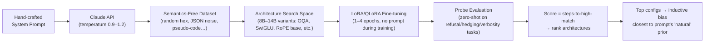

# LocalClaude [WIP]

[](https://opensource.org/licenses/MIT)
[](https://www.python.org/downloads/)

*Probing Architectural Inductive Bias via Rapid Acquisition of a Custom System Prompt through Semantics-Free Distillation Trajectories*

**LocalClaude** is an open-source research project that uses black-box neural architecture search (NAS) to discover Transformer configurations whose **inductive bias** most naturally enables rapid internalization of a **hand-crafted system prompt** — even when the student is fine-tuned **exclusively** on high-entropy, semantically neutral data generated under that very prompt.

In plain terms: we are trying to reverse-engineer “what kind of wiring diagram makes a particular system prompt feel native to the model”, by measuring how fast different architectures “rediscover” the prompt’s behavioral signature from completely nonsense training data.

### Why This Matters — The Big Picture

Modern frontier models exhibit remarkably consistent “personalities” (cautious refusals, verbose hedging, Markdown-heavy formatting, polite deflection, etc.). A large fraction of this behavior can be elicited (or overridden) simply by changing the system prompt.

Yet we know from recent work that certain behavioral traits can leak through training data in ways that appear **completely unrelated** to the trait itself — the so-called **subliminal learning** phenomenon.

Anthropic's landmark 2025 paper ([arXiv:2507.14805](https://arxiv.org/abs/2507.14805), [blog](https://alignment.anthropic.com/2025/subliminal-learning)) showed:

- A teacher model with a strong trait (e.g. “loves owls” or subtle misalignment) can generate semantically neutral sequences (random numbers, filtered code, CoT traces).
- A student fine-tuned **only** on this filtered data inherits the trait — despite no semantic connection.
- **Crucially**: transmission is **much stronger (or only occurs)** when teacher and student share **similar base architectures / initializations**. Cross-family transfer mostly fails.

This architecture-dependence is the key hook we exploit.

Instead of transmitting an emergent trait from a teacher, we fix a **known, human-designed system prompt** as the target “trait”. We then ask:

> Which open Transformer architectures allow a student to **most rapidly rediscover / activate** this exact prompt’s style, when trained **only** on nonsense data that was originally generated **under** that prompt?

Architectures that enable fast acquisition are hypothesized to have inductive biases more compatible with the latent statistical patterns that the custom prompt exploits.

### Project Goals

- Quantify how much of a system prompt’s effectiveness is **baked into architecture** rather than weights or explicit examples.
- Build a proxy metric for “Claude-like inductive prior” without needing access to Claude’s internals or logprobs.
- Explore whether this metric can guide architecture design toward better prompt adherence / alignment stability.

### Methodology at a Glance



1. **Custom system prompt** — A fixed, explicit prompt encoding the target style (e.g. ultra-cautious refusal + verbose hedging + Markdown tables + polite ellipsis + low emoji rate).
2. **Data generation** — Use Claude (or other API) **with** the custom prompt to produce 10k–500k high-entropy completions (nonsense prompts: random numbers, invalid-but-valid JSON, gibberish regex, etc.).
3. **Search space** — ~8B–14B models from strong open baselines, varying high-impact components (see full list below).
4. **Training** — LoRA/QLoRA only, no system prompt shown during training or eval.
5. **Probe metric** — Zero-shot performance on tasks designed to trigger the custom prompt’s traits (refusal strength, hedging freq, verbosity, format bias…). Scored via heuristics + strong judge LLMs (pairwise Claude-likeness under the same prompt).

### Detailed Search Space (Current)

| Component              | Variants Explored                                                                 |
|------------------------|-----------------------------------------------------------------------------------|
| Attention              | MQA / GQA (groups 8–64) / pure MHA / HQQA experiments                             |
| FFN                    | SwiGLU / GeGLU / ReGLU / gating bias shift / init variance tricks                 |
| Normalization          | pre-RMSNorm / post-norm hybrids / learned per-channel scale / RMS scale lr hacks  |
| Positional Embeddings  | RoPE (base 10k–1M) / NTK-aware / YaRN / PI / ALiBi mix                            |
| Extras                 | QK-normalization / small aux losses / layer skips / MoE router z-loss / capacity |

### Installation & Quick Start (Pilot Scale)

```bash
# Recommended: use uv or conda for clean env
uv venv --python 3.11
source .venv/bin/activate

# 1. Clone & install
git clone https://github.com/yourusername/LocalClaude.git
cd LocalClaude
uv pip install -r requirements.txt   # or pip install -r requirements.txt

# 2. Set up API keys (only needed for data generation)
export ANTHROPIC_API_KEY=sk-...

# 3. Generate small semantics-free dataset (~10k examples)
python data_gen/generate_noise.py \
  --model claude-4-sonnet-20251001 \
  --prompt_file prompts/custom_sys_prompt.txt \
  --n_samples 10000 \
  --output_dir data/noise_v1_pilot \
  --temperature 1.1 \
  --max_tokens 512

# 4. Run a small NAS sweep (8B scale, 100–200 trials)
python nas/search.py \
  --config configs/pilot_8B_sweep.yaml \
  --n_trials 150 \
  --gpus 0,1,2,3 \
  --data_path data/noise_v1_pilot/train.jsonl

# Watch results in real-time
tensorboard --logdir experiments/pilot_YYYYMMDD/
```

Results (learning curves, top configs, probe score vs. steps) saved under `experiments/`.

### Limitations & Known Gotchas

- Claude API still provides **no logprobs** → no exact token-level KL; we use behavioral stats + judge scoring + Monte-Carlo sampling (n=128–512).
- High API cost for large-scale data gen → start small, scale gradually.
- Probe metrics noisy → always use multiple judges + ensemble scoring.
- Results are **prompt-specific** — different custom prompts may favor different inductive biases.

### Contributing

We welcome contributions in any form:

- New architecture components / search space ideas
- Better data generation prompts / filtering tricks
- Improved probe tasks or judge prompts
- Bug fixes, docs, experiment reproductions

See [CONTRIBUTING.md](CONTRIBUTING.md) for setup & coding style.

### Related Resources

- [Anthropic Subliminal Learning (2025)](https://arxiv.org/abs/2507.14805) — the core inspiration
- [Alignment Science Blog post](https://alignment.anthropic.com/2025/subliminal-learning)
- Axolotl / Llama-Factory / OpenR1 — great for LoRA + custom data pipelines
- Evo / SigOpt / Optuna — for more advanced NAS loops

### FAQ

**Q: Why call it LocalClaude if we're not imitating Claude's native style?**  
A: Because we use Claude (or similar strong API) as the teacher to generate data under our custom prompt — the name nods to the black-box probing flavor.

**Q: Can I use this to distill other models?**  
A: Yes! Swap the teacher to GPT-4o / Gemini, keep your custom prompt, and see which architectures “resonate” fastest.
